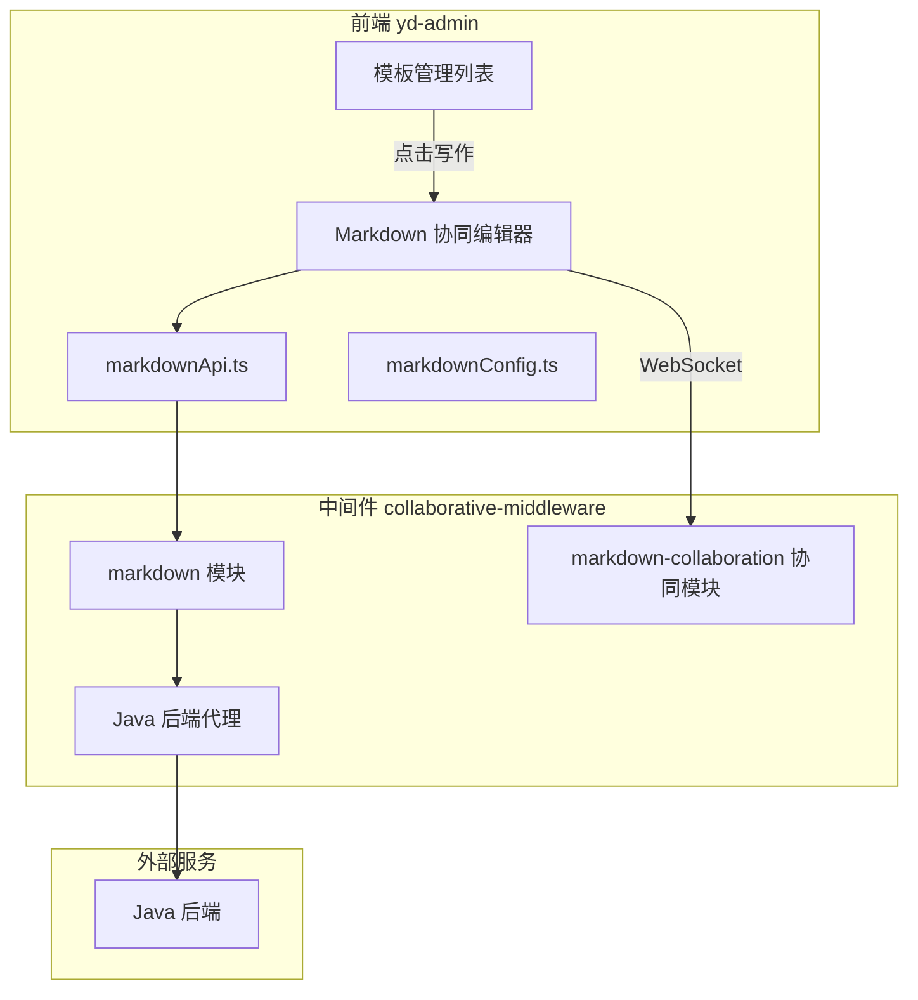

# 模板管理 Markdown 协同编辑器实现计划

## 架构概览



## 一、中间件新增模块 (collaborative-middleware)

### 1.1 Markdown 文档服务模块

创建 `src/markdown/` 目录，包含：

- [markdown.module.ts](e:/job-project/collaborative-middleware/src/markdown/markdown.module.ts) - 模块定义
- [markdown.service.ts](e:/job-project/collaborative-middleware/src/markdown/markdown.service.ts) - 服务层
  - `getMarkdown(id)` - 获取 Markdown 文档
  - `saveMarkdown(data)` - 保存文档
  - `getMaterials(id)` - 获取参考素材（代理 Java）
  - `saveMarkdownFile(id, file)` - 保存文件到 Java
  - `submitAudit(data)` - 提交审核
- [markdown.controller.ts](e:/job-project/collaborative-middleware/src/markdown/markdown.controller.ts) - 控制器
  - `GET /markdown/:id` - 获取文档
  - `POST /markdown/save` - 保存文档
  - `POST /markdown/:id/materials` - 获取素材
  - `POST /markdown/saveDocument` - 保存文件
  - `POST /markdown/submitAudit` - 提交审核

### 1.2 独立的 Markdown 协同模块

创建 `src/markdown-collaboration/` 目录：

- [markdown-collaboration.module.ts](e:/job-project/collaborative-middleware/src/markdown-collaboration/markdown-collaboration.module.ts) - 模块定义
- [markdown-collaboration.gateway.ts](e:/job-project/collaborative-middleware/src/markdown-collaboration/markdown-collaboration.gateway.ts) - WebSocket 网关
  - 独立的协同房间管理（与 document 模块隔离）
  - Y.js 文档同步
  - Awareness 状态管理（在线用户）
  - 使用 `/markdown` 作为 WebSocket 命名空间

### 1.3 更新 app.module.ts

注册新模块到应用。

## 二、前端新增模块 (yd-admin)

### 2.1 创建编辑器目录结构

```
src/views/template/editor/
├── MarkdownCollaborativeEditor.vue    # 主编辑页面
├── api/
│   └── markdownApi.ts                  # API 接口
├── config/
│   └── markdownConfig.ts               # 编辑器配置
└── components/
    ├── MarkdownEditor.vue              # Tiptap Markdown 编辑器
    └── MarkdownCollaborationPanel.vue  # 协同面板
```

### 2.2 核心文件说明

**[MarkdownCollaborativeEditor.vue](e:/job-project/yd-admin/src/views/template/editor/MarkdownCollaborativeEditor.vue)**

- 主页面，参考 `TiptapCollaborativeEditor.vue` 结构
- 顶部状态栏：返回、文档标题、连接状态、提交审核、保存按钮
- 主内容区：Markdown 编辑器
- 右侧面板：协同用户、参考素材、文档属性
- 参考素材抽屉

**[MarkdownEditor.vue](e:/job-project/yd-admin/src/views/template/editor/components/MarkdownEditor.vue)**

- 基于 Tiptap 编辑器
- 集成 `@tiptap/extension-markdown` 或 `tiptap-markdown` 扩展
- 支持 Markdown 语法快捷输入（如 `# ` 自动变标题，`- ` 自动变列表）
- 保留协同编辑能力（Yjs + WebsocketProvider）
- 工具栏支持常用 Markdown 操作

**[markdownApi.ts](e:/job-project/yd-admin/src/views/template/editor/api/markdownApi.ts)**

- 独立的 API 接口，连接 `/api/markdown` 端点
- `getMarkdownDocument(id)` - 获取文档
- `saveMarkdownDocument(params)` - 保存文档
- `getReferenceMaterials(id)` - 获取素材
- `saveMarkdownFile(id, file)` - 保存文件
- `submitAudit(params)` - 提交审核
- `exportHtml(title, content)` - 导出 HTML
- `exportJson(id, title, content)` - 导出 JSON

**[markdownConfig.ts](e:/job-project/yd-admin/src/views/template/editor/config/markdownConfig.ts)**

- WebSocket URL 配置（指向独立的 markdown 协同端点）
- 编辑器默认配置

### 2.3 修改模板管理页面

修改 [index.vue](e:/job-project/yd-admin/src/views/template/management/index.vue)：

- 修改 `handleEdit` 方法，使用 `router.push` 跳转到编辑器页面
- 传递模板 ID 和标题参数

### 2.4 添加路由配置

在 [remaining.ts](e:/job-project/yd-admin/src/router/modules/remaining.ts) 添加：

```typescript
{
  path: '/template/editor/:id',
  name: 'TemplateEditor',
  component: () => import('@/views/template/editor/MarkdownCollaborativeEditor.vue'),
  meta: { hidden: true, title: '模板写作', noCache: true }
}
```

## 三、与现有模块的隔离

| 特性 | Document 模块 | Markdown 模块 |

|------|--------------|---------------|

| API 路径 | `/api/document/*` | `/api/markdown/*` |

| WebSocket 路径 | `ws://host:port/{docId}` | `ws://host:port/markdown/{docId}` |

| Y.Doc 存储 | docs Map | markdownDocs Map |

| 前端路由 | `/document/editor/:id` | `/template/editor/:id` |

| 用途 | 绩效文档编辑 | 模板写作编辑 |

## 四、关键实现细节

### Markdown 扩展配置

使用 `tiptap-markdown` 包实现 Markdown 语法支持：

```typescript
import { Markdown } from 'tiptap-markdown'

extensions: [
  Markdown.configure({
    html: true,
    transformPastedText: true,
    transformCopiedText: true
  })
]
```

### 协同编辑隔离

Markdown 协同网关使用独立的命名空间和端口路径，避免与 document 协同混淆：

- document: `ws://host:port/{documentId}`
- markdown: `ws://host:port/markdown/{templateId}`